# Data Engineering YouTube Analysis Project by AMV

## Overview

This project aims to securely manage, streamline, and perform analysis on the structured and semi-structured YouTube videos data based on the video categories and the trending metrics.

## Project Goals
1. Data Ingestion — Build a mechanism to ingest data from different sources
2. ETL System — We are getting data in raw format, transforming this data into the proper format
3. Data lake — We will be getting data from multiple sources so we need centralized repo to store them
4. Scalability — As the size of our data increases, we need to make sure our system scales with it
5. Cloud — We can’t process vast amounts of data on our local computer so we need to use the cloud, in this case, we will use AWS
6. Reporting — Build a dashboard to get answers to the question we asked earlier

## Services we will be using
1. Amazon S3: Amazon S3 is an object storage service that provides manufacturing scalability, data availability, security, and performance.
2. AWS IAM: This is nothing but identity and access management which enables us to manage access to AWS services and resources securely.
3. QuickSight: Amazon QuickSight is a scalable, serverless, embeddable, machine learning-powered business intelligence (BI) service built for the cloud.
4. AWS Glue: A serverless data integration service that makes it easy to discover, prepare, and combine data for analytics, machine learning, and application development.
5. AWS Lambda: Lambda is a computing service that allows programmers to run code without creating or managing servers.
6. AWS Athena: Athena is an interactive query service for S3 in which there is no need to load data it stays in S3.


## Index
* [Dataset info](#about-dataset) 
* [AWS set-up](#aws-basic-set-up)
* [JSON reference data ETL](#json-reference-data)
* [CSV raw_statistics data ETL](#csv-data)
* [Join JSON reference data and CSV raw_statistics into analytical s3 bucket and Data Catalog](#analytics-s3-bucker-and-data-catalog)
* [AWS QuickSight simple example dashboard.](#aws-quicksight)

## Architecture Diagram


## Project Overview
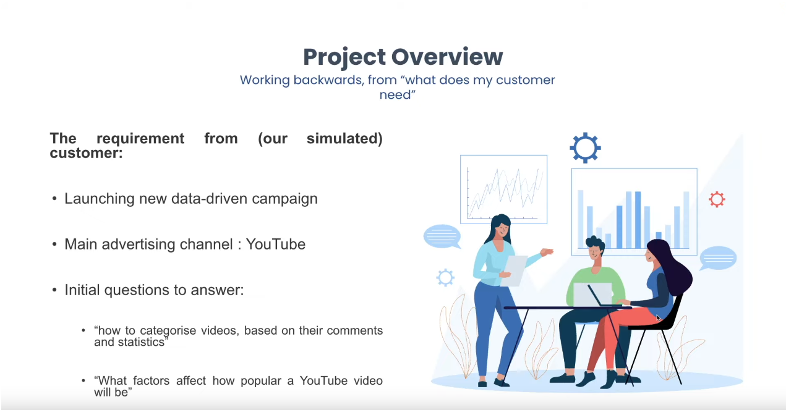
## Project goals and steps
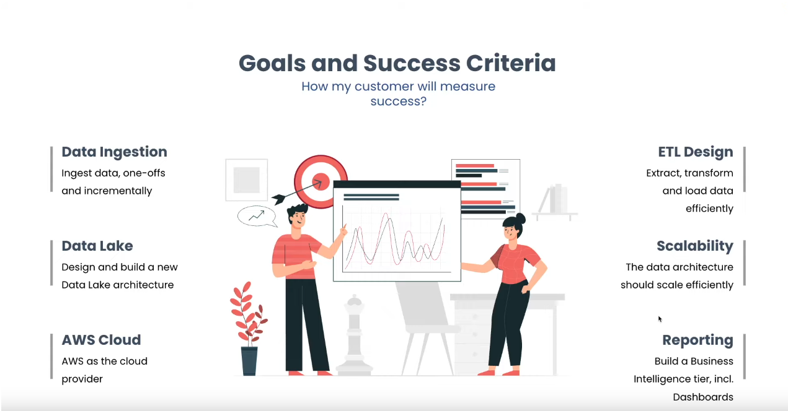


## About Dataset

This Kaggle dataset contains statistics (CSV files) on daily popular YouTube videos over the course of many months. There are up to 200 trending videos published every day for many locations. The data for each region is in its own file. The video title, channel title, publication time, tags, views, likes and dislikes, description, and comment count are among the items included in the data. A category_id field, which differs by area, is also included in the JSON file linked to the region.

https://www.kaggle.com/datasets/datasnaek/youtube-new
#### Context

YouTube (the world-famous video sharing website) maintains a list of the top trending videos on the platform. According to Variety magazine, “To determine the year’s top-trending videos, YouTube uses a combination of factors including measuring users interactions (number of views, shares, comments and likes). Note that they’re not the most-viewed videos overall for the calendar year”. Top performers on the YouTube trending list are music videos (such as the famously virile “Gangam Style”), celebrity and/or reality TV performances, and the random dude-with-a-camera viral videos that YouTube is well-known for.

This dataset is a daily record of the top trending YouTube videos.

Content

This dataset includes several months (and counting) of data on daily trending YouTube videos. Data is included for the US, GB, DE, CA, and FR regions (USA, Great Britain, Germany, Canada, and France, respectively), with up to 200 listed trending videos per day.

EDIT: Now includes data from RU, MX, KR, JP and IN regions (Russia, Mexico, South Korea, Japan and India respectively) over the same time period.

Each region’s data is in a separate file. Data includes the video title, channel title, publish time, tags, views, likes and dislikes, description, and comment count.

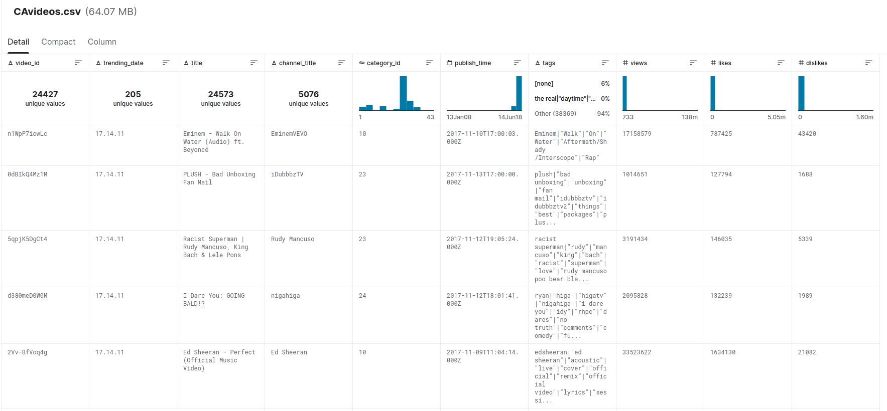

The data also includes a category_id field, which varies between regions. To retrieve the categories for a specific video, find it in the associated JSON. One such file is included for each of the five regions in the dataset.

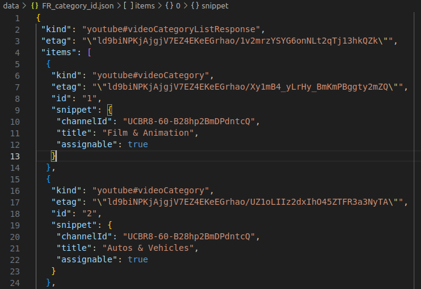


## AWS basic set-up 
### Create IAM user for the project
- Created a IAM user for the project to not use the root user, for security reasons.
- I have used AdministratorAccess for simplicity.

### Create S3 bucket
* Created a S3 bucket with name "de-on-youtube-raw-eu-west3-dev" on eu-west-3 region, as the name 
indicates.


### Copy JSON Reference data into S3 bucket
* Using aws cli, we copy all JSON reference data into the s3 bucket, inside the following directories "youtube/raw_statistics_reference_data/" 
    ```
    aws s3 cp . s3://de-on-youtube-raw-eu-west3-dev/youtube/raw_statistics_reference_data/ --recursive --exclude "*" --include "*.json"
    ```
    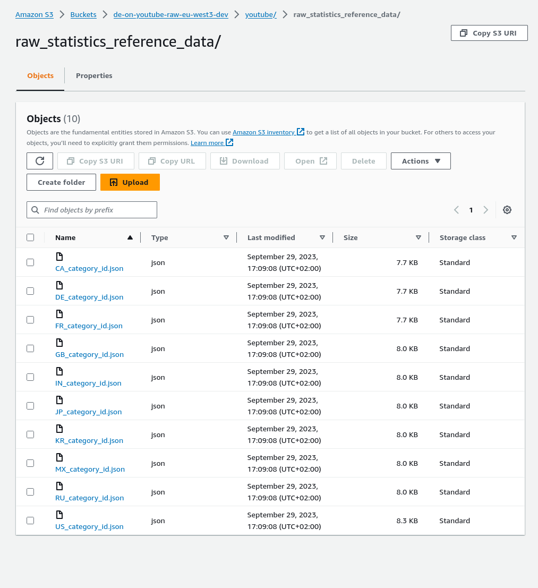
### Copy all data files to its own location, following Hive-style patterns:
*
    ```console
        aws s3 cp CAvideos.csv s3://de-on-youtube-raw-eu-west3-dev/youtube/raw_statistics/region=ca/
        aws s3 cp DEvideos.csv s3://de-on-youtube-raw-eu-west3-dev/youtube/raw_statistics/region=de/
        aws s3 cp FRvideos.csv s3://de-on-youtube-raw-eu-west3-dev/youtube/raw_statistics/region=fr/
        aws s3 cp GBvideos.csv s3://de-on-youtube-raw-eu-west3-dev/youtube/raw_statistics/region=gb/
        aws s3 cp INvideos.csv s3://de-on-youtube-raw-eu-west3-dev/youtube/raw_statistics/region=in/
        aws s3 cp JPvideos.csv s3://de-on-youtube-raw-eu-west3-dev/youtube/raw_statistics/region=jp/
        aws s3 cp KRvideos.csv s3://de-on-youtube-raw-eu-west3-dev/youtube/raw_statistics/region=kr/
        aws s3 cp MXvideos.csv s3://de-on-youtube-raw-eu-west3-dev/youtube/raw_statistics/region=mx/
        aws s3 cp RUvideos.csv s3://de-on-youtube-raw-eu-west3-dev/youtube/raw_statistics/region=ru/
        aws s3 cp USvideos.csv s3://de-on-youtube-raw-eu-west3-dev/youtube/raw_statistics/region=us/
    ```
    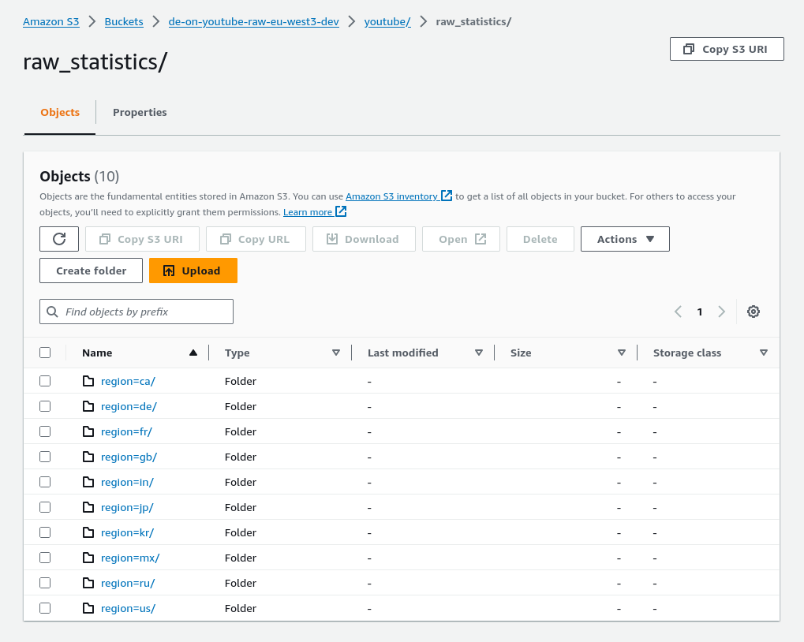


## JSON reference data

### Create aws Glue catalog
- Created a role in order to give glue access to s3 and glue service.
- Created a glue database called "de_youtube_raw".
- Created a crawler to run against "raw_statistics_reference_data/".
- Finally we have a table in our database with the JSON raw reference data.
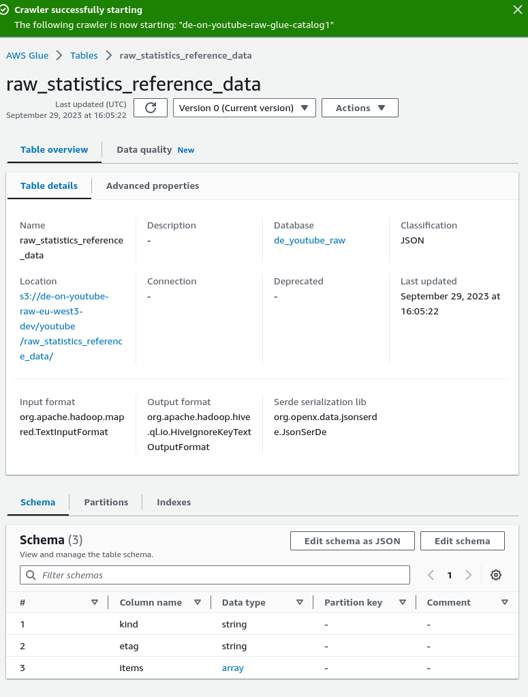

### Using Athena and SQL to query data
- In order to use Athena we must create a new s3 bucket which will be called "de-on-youtube-raw-eu-west3-athena-job".
- As we can see, we have an error while trying to query the table,
this is because Athena crawler can't handle our JSON data, as we can see it have 3 keys, "kind", "etag" and "items" and we need only the data inside "items" key.
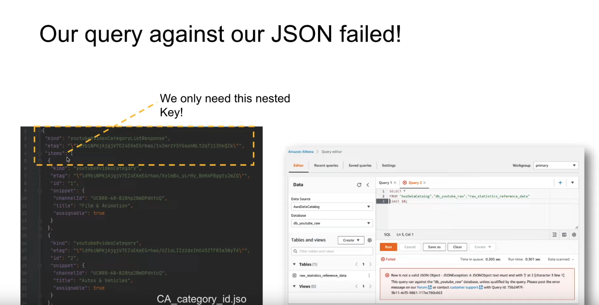
* We can check AWS documentation
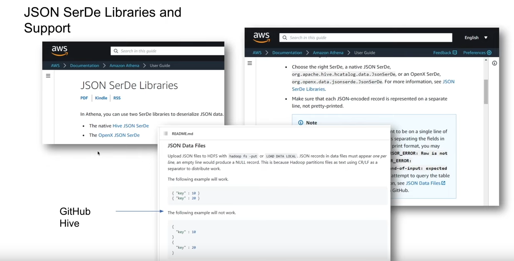
Therefore we need to do some preprocessing before creating the crawler.

## JSON reference data Cleanising     
#### Pipeline structure
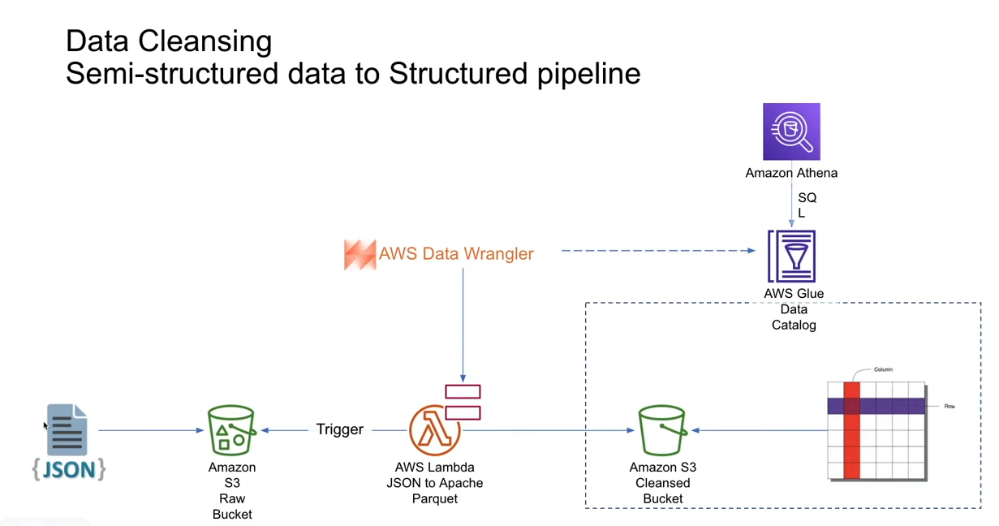
* Create a Lambda function to transform raw data.
* Create a Glue crawler.
#### Lambda function
We will use python 3.8 to build a lambda function to transform our raw JSON reference data.

* Created new role, for the lambda function in order to access the data.
* Created Lambda function.
* Configured timeout to be 3 min.
* Added a layer "AWSSDKPandas-Python38" to use awswrangler library that we will use in our code.
* Created a Test event using the following s3 template.
    ```JSON
    {
        "Records": [
            {
            "eventVersion": "2.0",
            "eventSource": "aws:s3",
            "awsRegion": "us-east-1",
            "eventTime": "1970-01-01T00:00:00.000Z",
            "eventName": "ObjectCreated:Put",
            "userIdentity": {
                "principalId": "EXAMPLE"
            },
            "requestParameters": {
                "sourceIPAddress": "127.0.0.1"
            },
            "responseElements": {
                "x-amz-request-id": "EXAMPLE123456789",
                "x-amz-id-2": "EXAMPLE123/5678abcdefghijklambdaisawesome/mnopqrstuvwxyzABCDEFGH"
            },
            "s3": {
                "s3SchemaVersion": "1.0",
                "configurationId": "testConfigRule",
                "bucket": {
                "name": "de-on-youtube-raw-eu-west3-dev",
                "ownerIdentity": {
                    "principalId": "EXAMPLE"
                },
                "arn": "arn:aws:s3:::de-on-youtube-raw-eu-west3-dev"
                },
                "object": {
                "key": "youtube/raw_statistics_reference_data/US_category_id.json",
                "size": 1024,
                "eTag": "0123456789abcdef0123456789abcdef",
                "sequencer": "0A1B2C3D4E5F678901"
                }
            }
            }
        ]
    }
    ```
* Added the following environment variables
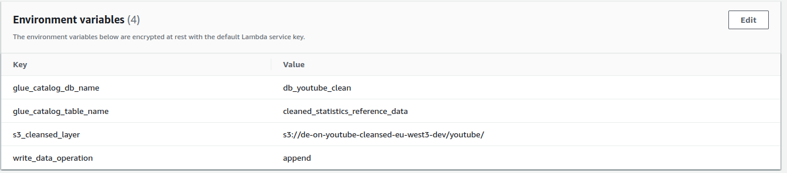
* Lambda function code:
    ```python
    import awswrangler as wr # files and store
    import pandas as pd
    import urllib.parse
    import os


    #Temporary hard-coded AWS Settings; i.e. to be set as OS variable in Lambda
    os_input_s3_cleansed_layer = os.environ['s3_cleansed_layer']
    os_input_glue_catalog_db_name = os.environ['glue_catalog_db_name']
    os_input_glue_catalog_table_name = os.environ['glue_catalog_table_name']
    os_input_write_data_operation = os.environ['write_data_operation']


    def lambda_handler(event, context):
        # Get the object from the event and show its content type
        bucket = event['Records'][0]['s3']['bucket']['name']
        key = urllib.parse.unquote_plus(event['Records'][0]['s3']['object']['key'], encoding='utf-8')
        try:

            # Creating DF from content
            df_raw = wr.s3.read_json('s3://{}/{}'.format(bucket, key))

            # Extract required columns:
            df_step_1 = pd.json_normalize(df_raw['items'])

            # Write to S3
            print("writing to s")
            wr_response = wr.s3.to_parquet(
                df=df_step_1,
                path=os_input_s3_cleansed_layer,
                dataset=True,
                database=os_input_glue_catalog_db_name,
                table=os_input_glue_catalog_table_name,
                mode=os_input_write_data_operation
            )

            return wr_response
        except Exception as e:
            print(e)
            print('Error getting object {} from bucket {}. Make sure they exist and your bucket \\
            is in the same region as this function.'.format(key, bucket))
            raise e
    ```
* Run the test.

### Athena Querie on "cleaned_statistics_reference_data"
* Now we have our JSON reference data ready to use.
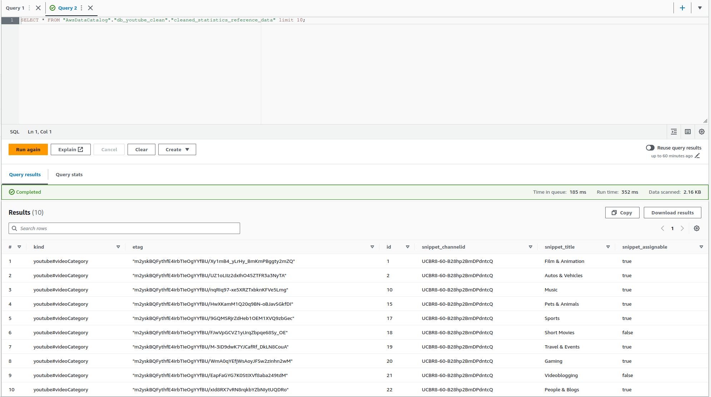    


## CSV data

### Glue raw catalog
* Created a crawler named "de-on-youtube-raw-csv-crawler-01" to run agains our csv raw data.
* Now we have our partitioned table over "region" with the following schema in our glue "de_youtube_raw" database.
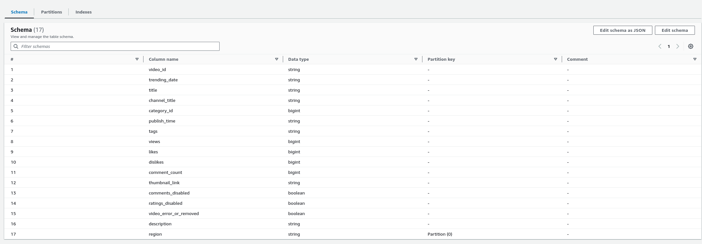
* We can query on a particular region and it will only return the data from that particular bucket. 

### Athena query trying to join JSON reference data and raw_statistics
* Join csv raw data from de_youtube_raw.raw_statistics and json cleaned reference data from db_youtube_clean.cleaned_statistics_reference_data
    ```sql
    SELECT a.title, a.category_id, b.snippet_title FROM "de_youtube_raw"."raw_statistics" as a
    INNER JOIN "db_youtube_clean"."cleaned_statistics_reference_data" as b ON a.category_id=b.id
    WHERE region='ca';
    ```
* This query will return an error because as we can see in the schema of "cleaned_statistics_reference_data" table, the id key is a string type and category_id from "raw_statistics" table is int, we could use cast() to solve the error but as the data grows it will be expensive and inefficient. Therefore we will need to change the type of the first to int, remove our parquet data from "de-on-youtube-cleansed-eu-west3-dev" s3 bucket and run the lambda function again to append the data to the new schema structure.

* Now it have the correct data types.
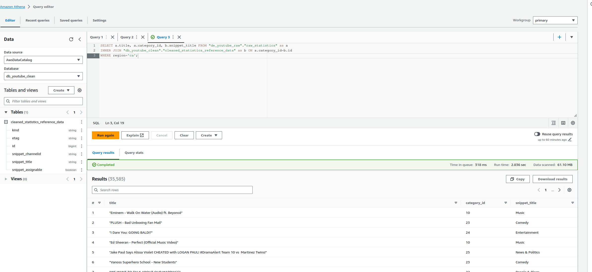

### AWS Glue ETL job on de_youtube_raw database, raw_statistics table to s3 "de-on-youtube-cleansed-eu-west3-dev/youtube/raw_statistics/" bucket and crawler on that bucket to de_youtube_clean database, raw_statistics table 
* Created a new job named "de-on-youtube-cleansed-csv-to-parquet", with data source "s3://de-on-youtube-raw-eu-west3-dev/youtube/raw_statistics/" and target "s3://de-on-youtube-cleansed-eu-west3-dev/youtube/raw_statistics/" in order to transform our csv files to parquet.
* To keep it simple, we will select only a few regions because if not, we will need to deal with utf-8 codification, therefore we will use the following  pushdown predicate to drop those regions.
    ```python
        S3raw_node1 = glueContext.create_dynamic_frame.from_catalog(
            database="de_youtube_raw",
            push_down_predicate="region in ('ca', 'gb', 'us')",
            table_name="raw_statistics",
            transformation_ctx="S3raw_node1",
        )
    ```
* Partition keys:
    ```python
    "partitionKeys": ["region"],
    ```
* Now we have out raw statistics data in parquet format on our s3 bucket
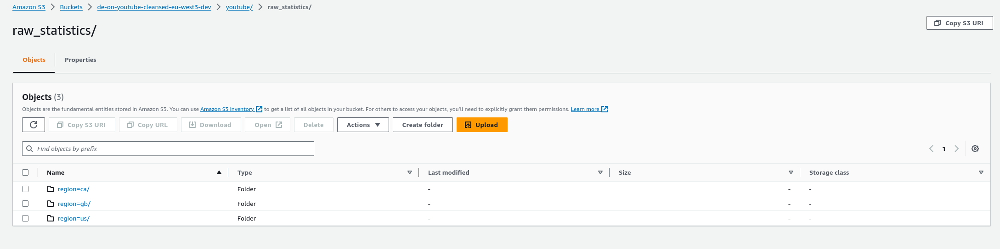

* We run the crawler "de-on-youtube-cleaned-csv-to-parquet-etl" on the previous s3 bucket and then we have our raw_statistics table.
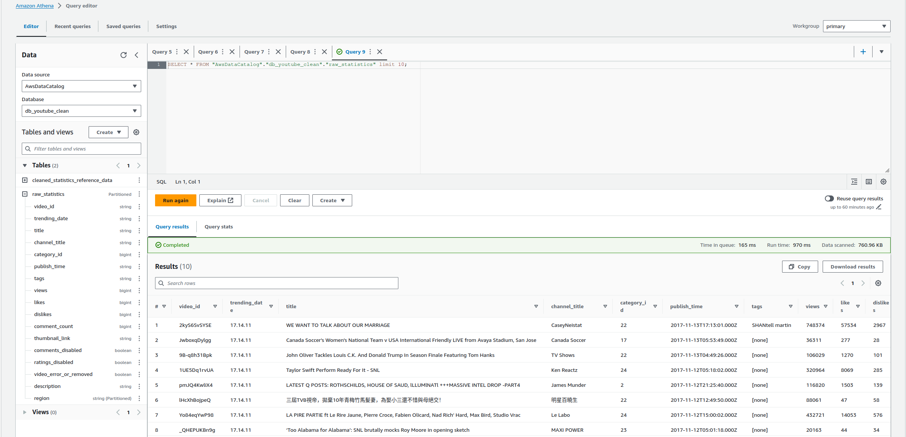


## Lambda function trigger

* Added a trigger to our lambda function in order to execute it when a JSON file is added, removed or copied from s3 "de-on-youtube-raw-eu-west3-dev/youtube/raw_statistics_reference_data/" bucket.
* Deleted all data from that bucket.
* Uploaded all the data again.

## Analytics S3 bucker and data catalog
### Athena job to join cleaned raw_statistics and json reference data
* Created s3 bucket named "de-on-youtube-analytics-eu-west3-dev".
* Created glue database named "db_youtube_analytics".
* Created Athena job joining out two data catalog using a join transform, selecting the previous s3 bucket as a target, creating a table "final_analytics" on "db_youtube_analytics" glue database with two partitions, by 'region' and 'category_id'.
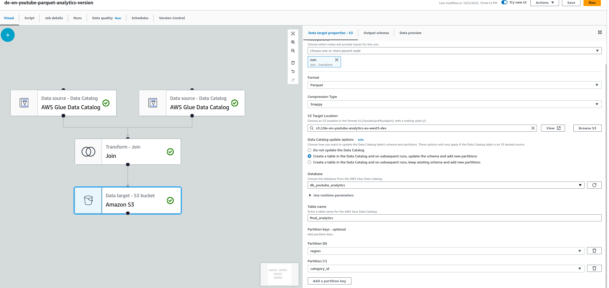
* We can see the pyspark script:
    ```python
    import sys
    from awsglue.transforms import *
    from awsglue.utils import getResolvedOptions
    from pyspark.context import SparkContext
    from awsglue.context import GlueContext
    from awsglue.job import Job

    args = getResolvedOptions(sys.argv, ["JOB_NAME"])
    sc = SparkContext()
    glueContext = GlueContext(sc)
    spark = glueContext.spark_session
    job = Job(glueContext)
    job.init(args["JOB_NAME"], args)

    # Script generated for node AWS Glue Data Catalog
    AWSGlueDataCatalog_node1696538249086 = glueContext.create_dynamic_frame.from_catalog(
        database="db_youtube_clean",
        table_name="cleaned_statistics_reference_data",
        transformation_ctx="AWSGlueDataCatalog_node1696538249086",
    )

    # Script generated for node AWS Glue Data Catalog
    AWSGlueDataCatalog_node1696538275331 = glueContext.create_dynamic_frame.from_catalog(
        database="db_youtube_clean",
        table_name="raw_statistics",
        transformation_ctx="AWSGlueDataCatalog_node1696538275331",
    )

    # Script generated for node Join
    Join_node1696538341099 = Join.apply(
        frame1=AWSGlueDataCatalog_node1696538249086,
        frame2=AWSGlueDataCatalog_node1696538275331,
        keys1=["id"],
        keys2=["category_id"],
        transformation_ctx="Join_node1696538341099",
    )

    # Script generated for node Amazon S3
    AmazonS3_node1696538491828 = glueContext.getSink(
        path="s3://de-on-youtube-analytics-eu-west3-dev",
        connection_type="s3",
        updateBehavior="UPDATE_IN_DATABASE",
        partitionKeys=["region", "category_id"],
        compression="snappy",
        enableUpdateCatalog=True,
        transformation_ctx="AmazonS3_node1696538491828",
    )
    AmazonS3_node1696538491828.setCatalogInfo(
        catalogDatabase="db_youtube_analytics", catalogTableName="final_analytics"
    )
    AmazonS3_node1696538491828.setFormat("glueparquet")
    AmazonS3_node1696538491828.writeFrame(Join_node1696538341099)
    job.commit()
    ```


## AWS QuickSight
* Given permission to use our S3 buckets
* Create data souce, connecting it to Athena, selecting the analytics table we have created.
* Build an example dashboard.
* Publish dashboard.
    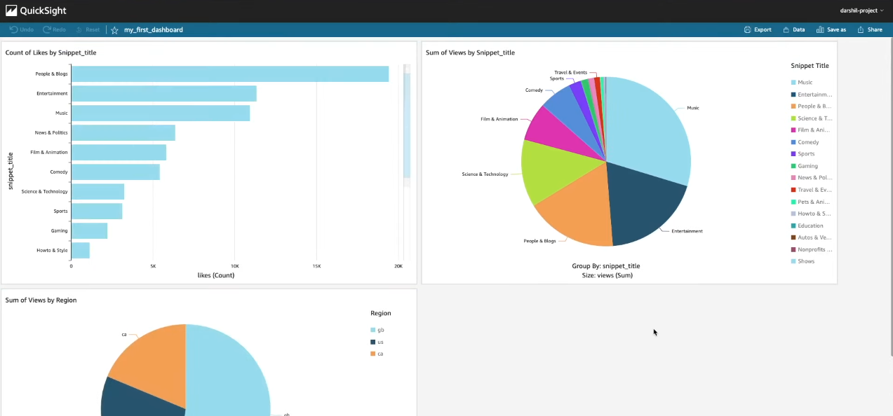


<br>
<br>
<br>
<br>

Credits to [darshilparmar](https://github.com/darshilparmar/dataengineering-youtube-analysis-project)
